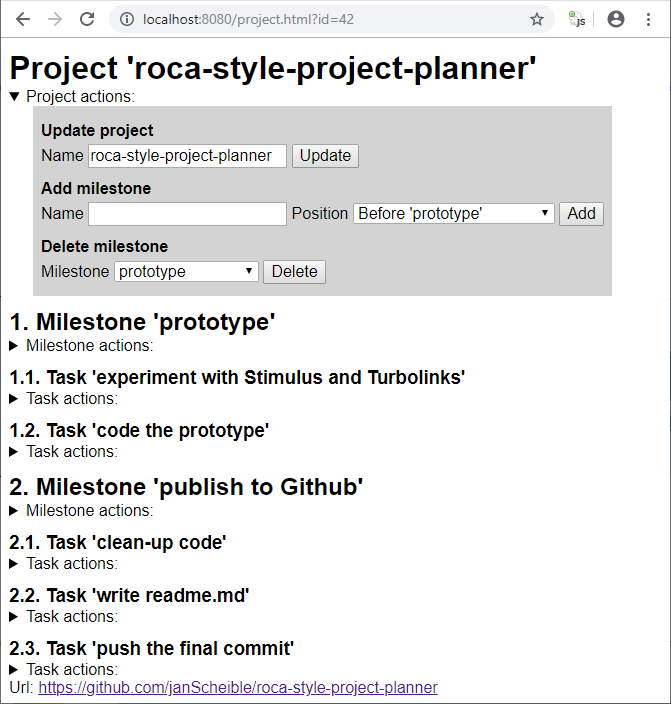

# roca-style-project-planner

This repository was inspired by the article [Escaping the SPA rabbit hole with modern Rails](https://medium.com/@jmanrubia/escaping-the-spa-rabbit-hole-with-turbolinks-903f942bf52c).
The author mentions [Stimulus](https://stimulusjs.org/) and [Turbolinks](https://github.com/turbolinks/turbolinks).
Implementing web applications in a style called [ROCA-Style](https://roca-style.org/) follows a similar spirit.
The server side returns plain HTML and the client-side is build around the idea of [Progressive Enhancement](https://developer.mozilla.org/en-US/docs/Glossary/Progressive_Enhancement).

The demo application in this repository uses a Spring Boot 2 backend with a simple project planner domain.
A project consists of milestones.
The milestones in turn have tasks.
Every task has an optional URL that points for example to an issue tracker.

The frontend can be used both with JavaScript completely disabled (useful Chrome addon is e.g. [One-Click JavaScript Toggle](https://chrome.google.com/webstore/detail/one-click-javascript-togg/ahjfodbngfpdppljbkhcfhcfdagfgcnj)) and in the "normal" mode with JavaScript enabled.
Whilst the UI is not pretty with JavaScript enabled it feels like a SPA application.
No fullpage-reloads and the srollbar does not jump back to the top.
The forms are send via AJAX to the backend and Turbolinks is used to refresh the HTML body.
Turbolink's cache is disabled cause the page should always be refreshed even with the same URI.
To avoid that the scrollbar jumps back to the top the current scroll position is remembered in the `turbolinks:before-visit` and restored in the `turbolinks:load` event.
Before every AJAX request a [CSS Loader](https://github.com/raphaelfabeni/css-loader) is displayed.
It only has to be removed manually in case of an error response.
In every other case it is automatically hidden when Turbolinks replaces the HTML body.

## Running the application
1. recent JDK 11
1. recent Maven (tested with 3.6.1)
1. [maven-skip-execution-profile-extension](https://github.com/janScheible/spring-boot-netbeans-getting-started/tree/master/skip-execution-profile/maven-skip-execution-profile-extension) with a [.mvn directory like this](https://github.com/janScheible/spring-boot-netbeans-getting-started/tree/master/spring-boot-netbeans-single-module/.mvn) in the root folder for a smooth Netbeans experience
1. `mvn clean install`
1. Netbeans 11 `Run` or `Debug`
1. `http://localhost:8080/project.html?id=42` with any id (the projects are only stored in-memory)

## Summary

Server-side templating, Stimulus and Turbolinks complement each other in a nice way.
On the backend side the whole request mapping can be done with simple Spring MVC form handling.
It is fast and fun to write a simple web application in that style.

Currently the progressive enhancement aspect only addresses the usage of AJAX instead of regular form POSTs (that was enough to test Stimulus and Turbolinks).
To improve the user experience for example [Modernizr](https://modernizr.com/)'s root element classes `.no-js` repectively `.js` can be used to show or hide elements.
In case of JavaScript enabled the forms could be hidden and some kind of inline editing functionality could be provided.
